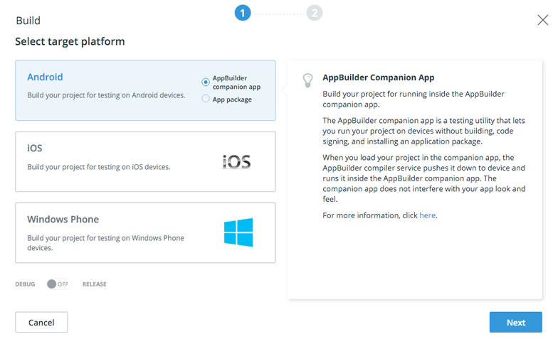

# Cordova Plugins in Action (PhoneGap Day 2016)

Sample project for the _Cordova Plugins in Action_ workshop at [PhoneGap Day 2016](http://pgday.phonegap.com/us2016/) in Lehi, Utah.

## Links

* [This workshop’s slide deck](https://docs.google.com/presentation/d/17ZpdDpEDp6YOhhrUqNq6gix5C_hXpB3PUzghkdsR2ys/)
* [Telerik Verified Plugins Marketplace](http://plugins.telerik.com/cordova)
* [Telerik Platform](http://telerik.com/platform)

# Workshop Directions

## Requirements

1. Sign up for a free, 30-day trial of the [Telerik Platform](https://platform.telerik.com).
2. [Download/install the “Desktop Client - Universal”](https://platform.telerik.com/appbuilder/webclient/#/downloads) for your OS X or Windows development machine.
3. Download the [AppBuilder Companion App](http://www.telerik.com/platform/appbuilder/companion-app) for your iOS, Android or Windows Phone device from the marketplace

## Getting Started

1. Open the AppBuilder Desktop Client on your desktop.
1. Click the "Create App" button
	
	
1. Choose "Advanced"
	
	
1. Select the "Clone repository" option and enter `https://github.com/remotesynth/pluginSampleApp` as the repository URI and then click "Create App"
1. After the project loads, it will initially open to the project's "master" branch, which contains the workshop's completed code. You can [refer to this code](https://github.com/remotesynth/pluginSampleApp) at any time if you get stuck, but this workshop starts on the project's "starter" branch. To switch branches, go to "Version Control" > "Branches"

	
1. Select the "starter" branch and click "Checkout." This will switch your project to the version of the code that we will begin working with.

	
1. To return to your project click the project name next to "Dashboard" on the top of the AppBuilder window (it will most likely be "pluginSampleApp" if you left the default name)

### The Sample Application

Our sample application is built with Ionic (and AngularJS). Right now, if you were to run the application using one of the simulators (under the "Run" menu in AppBuilder), you'd see an empty Ionic app. However, the goal of this workshop is not to teach you Ionic or Angular (and don't worry if you don't know them already).

The goal of our sample application will be to leverage several Cordova plugins (namely a barcode scanner, social sharing and local notification). The UI for this application will be very simple and consist of only two views.

We will be leveraging the [AppBuilder Companion App](http://www.telerik.com/platform/appbuilder/companion-app) throughout this process to allow us to test our app on devices without needing to deploy the app to a phone. It will also allow us to update our app on our devices quickly. Most importantly, for the purposes of this workshop, it allows us to leverage the plugins we discussed without needing to build and deploy the full application package to a phone.

Let's get started.

## Adding the Barcode Scanner

[BarcodeScanner](http://plugins.telerik.com/cordova/plugin/barcodescanner) is a verified plugin written by Ryan Willoughby. Let's add it to our project.

The barcode scanner will be trigger by a button, so let's add one to our app.

1. Open templates/home.html in AppBuilder.
1. Place a button in between the `<ion-content>` tags.
	
		<button class="button button-block button-positive" ng-click="openBarcode()">
			Open Barcode Scanner
		</button>
1. Save the file.
1. Open js/app.js in AppBuilder.
1. Find the `PluginCtrl` for this view. It looks like this:
	
		.controller('PluginCtrl', function($scope, $state) {
		})
1. Take the sample code from the [BarcodeScanner page](http://plugins.telerik.com/cordova/plugin/barcodescanner) and place it within the `PluginCtrl` controller, defining it as `openBarcode` within our `$scope`:
		
		// open the barcode scanner
    	$scope.openBarcode = function() {
			cordova.plugins.barcodeScanner.scan(
		
		    // success callback function
		    function (result) {
		        // wrapping in a timeout so the dialog doesn't free the app
		        setTimeout(function() {
		            alert("We got a barcode\n" +
		                  "Result: " + result.text + "\n" +
		                  "Format: " + result.format + "\n" +
		                  "Cancelled: " + result.cancelled);                            
		        }, 0);
		    },
		
		    // error callback function
		    function (error) {
		        alert("Scanning failed: " + error);
		    },
		
		    // options object
		    {
		        "preferFrontCamera" : false,
		        "showFlipCameraButton" : true
		    });
		};
1. Save app.js

> It's important to note that we skipped the "Load in AppBuilder" (or "Download Plugin") step because we are relying on the AppBuilder Companion App having the plugin pre-installed. This is being done simply to simplify the workshop process. Under normal circumstances, you would not want to skip this step if you ever intend to build and deploy your app. 

Now let's test our app so far by building and deploying it to the [AppBuilder Companion App](http://www.telerik.com/platform/appbuilder/companion-app).

1. Select Run > Build (Cmd/Ctrl + B)
1. Choose your device type (iOS, Android, or Windows Phone), select the "AppBuilder Companion App" option, and then click next.

	
1. Open the AppBuilder Companion App on your device and open the QR scanner to scan the QR code that is produced by AppBuilder.
	>Note: You may need to do a two finger swipe from the left side of the device to open the menu (or use the notification) to find the scan option.
1. Once the app loads, click the "Open Barcode Scanner" button and scan the following QR code:

	
1. When the barcode successfully scans, you should receive a dialog box telling you the results of the scan.

	

Success! We're ready for the app store! But before we get that far, our UX "expert" says that just alerting the URL isn't enough. Ok, Mr. Fancypants, we'll fix it.

1. Create a new view template by right-clicking on the templates folder and selecting "Add" > "New File"

	
1. Name your new template "viewImage.html"
1. Replace the default HTML with the following Ionic view:

		<ion-view title="Pictures!">
		    <ion-pane>
		      <ion-header-bar class="bar-stable">
		        <h1 class="title">Plugin Sample App</h1>
		      </ion-header-bar>
		      <ion-content>
		          
		      </ion-content>
		    </ion-pane>
		</ion-view>
1. Save the file.
1. Open js/app.js
1. We need to add another state to our `$stateProvider` for our new view. Append the new state (`viewimage`) to the existing one like below:

		.state('app', {
		  url: '/app',
		  templateUrl: 'templates/home.html',
		  controller: 'PluginCtrl'
		})
		.state('viewimage', {
		  url: '/viewimage',
		  templateUrl: 'templates/viewImage.html',
		  controller: 'ImageCtrl'
		});
1. Within the `PluginCtrl` code, replace the contents of the success callback function (the one with the `// success callback function` comment above it) to set the result of the barcode scan to a variable and move to the `viewimage` state.

		scannedURL = result.text;
		$state.go('viewimage');
1. Add the `ImageCtrl` controller following the existing `PluginCtrl` controller:

		.controller('ImageCtrl', function($scope) {
		    $scope.imageURL = scannedURL;
		})
1. Save app.js.

We're ready to test our changes in the AppBuilder Companion App.

1. Within the AppBuilder Companion App, do a 3-finger tap and hold, which should trigger the updated code to be dowloaded and installed (or use the notification option for "LiveSync" if you're on Android).
1. Click the "Open Barcode Scanner" button and scan the barcode from earlier and bask in the glory!

	

## Add the SocialSharing Plugin (Optional)

Clearly, our app is awesome already. Nonetheless, if you have the time, let's try adding the [SocialSharing plugin](http://plugins.telerik.com/cordova/plugin/socialsharing), written by Eddy Verbruggen, to make it even more awesomer! You should try doing this yourself, but feel free to reference the instructions below if you get stuck.

1. Open templates/viewImage.html
1. Add a button underneath the image that people can click to share the image. This button will call the `share()` method within our controller (which we will create in a moment).

		<button class="button button-block button-positive" ng-click="share()">
            Share
        </button>
1. Save viewImage.html
1. Open js/app.js
1. Within `ImageCtrl`, create the `scan()` function directly below where we assign the image URL to the `$scope`.

		$scope.share = function() {
		   plugins.socialsharing.share(null, null, scannedURL, null);
		}
1. Save app.js
1. Reload the app in the AppBuilder Companion App, scan the QR code, click the "share" button and impress your friends with your wicked app development skills!

	

## Add the LocalNotification Plugin (Optional)

If you added the SocialSharing plugin, your app is already more awesomer. But you know what would make it the most awesomerest would be if it notified me that I successfully shared the image. To do that, we're going to use the [LocalNotification](http://plugins.telerik.com/cordova/plugin/localnotification) plugin written by Sebastián Katzer. Try doing this on your own, but feel free to reference the instructions below if you get stuck.

1. In js/app.js, we need to add a callback function to the social sharing plugin call that will trigger our nofication. Edit the existing social sharing call to add this callback.

		plugins.socialsharing.share(null, null, scannedURL, null, function() {
		   // called when the image is shared
		});
1. Paste the code below within the callback you just created. The code configures the notification plugin's options. Set the `at` option to right now (`new Date()` resolves to the current time), and add the `text` and `title` of your notification (for more detail on the other options, check the [documentation](http://plugins.telerik.com/cordova/plugin/localnotification) for this plugin)

		var options = {
			id:         1,
			at:         new Date(),
			text:       "Your friends will thank you",
			title:      "You shared the image",
			autoClear:  true
		};
1. Paste the code below right beneath the `options` initialization to call the notification plugin.

		cordova.plugins.notification.local.schedule(options);
1. Save app.js.
1. Refresh the app in the AppBuilder Companion App, scan the QR code, share the image and be completely blown away by the awesomeness of your notification!

	
